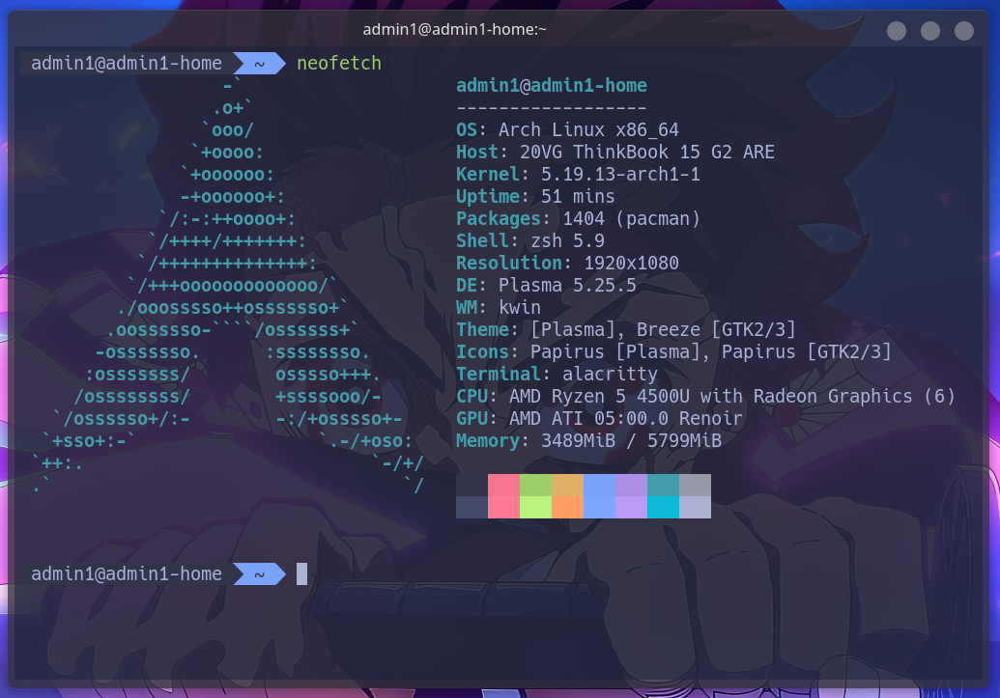
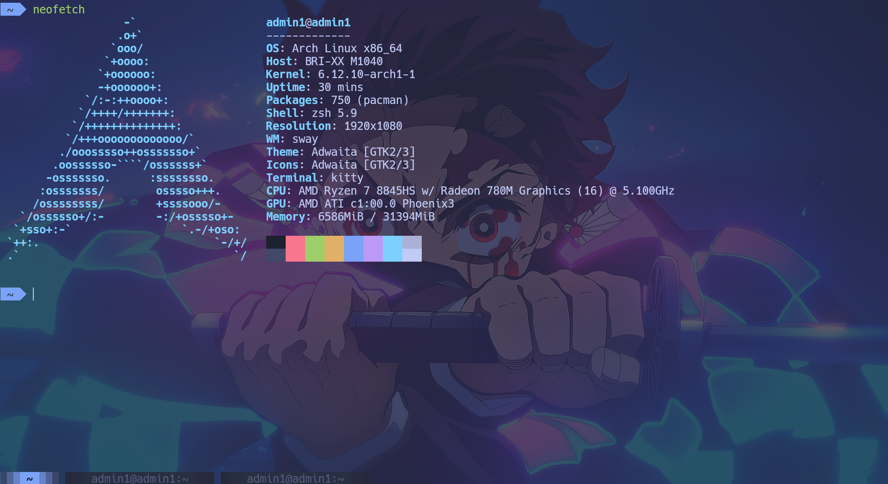
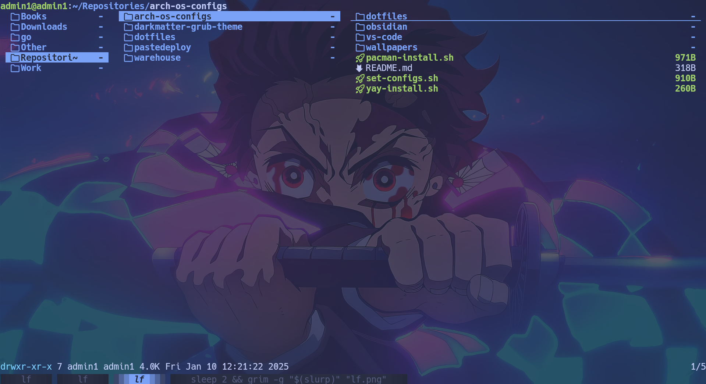
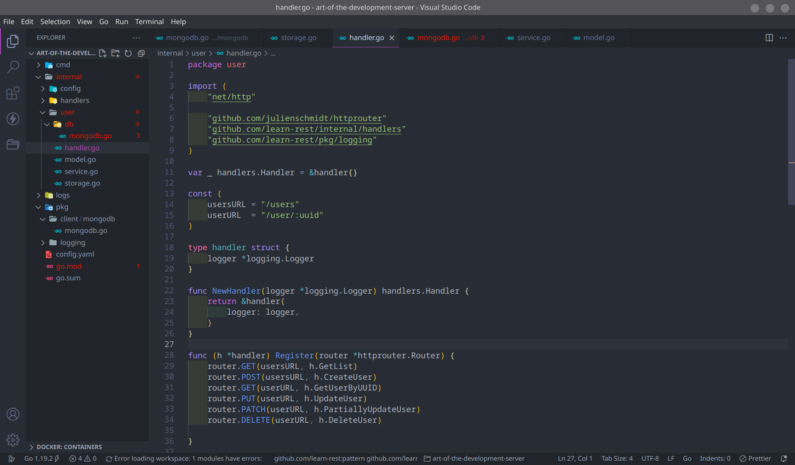
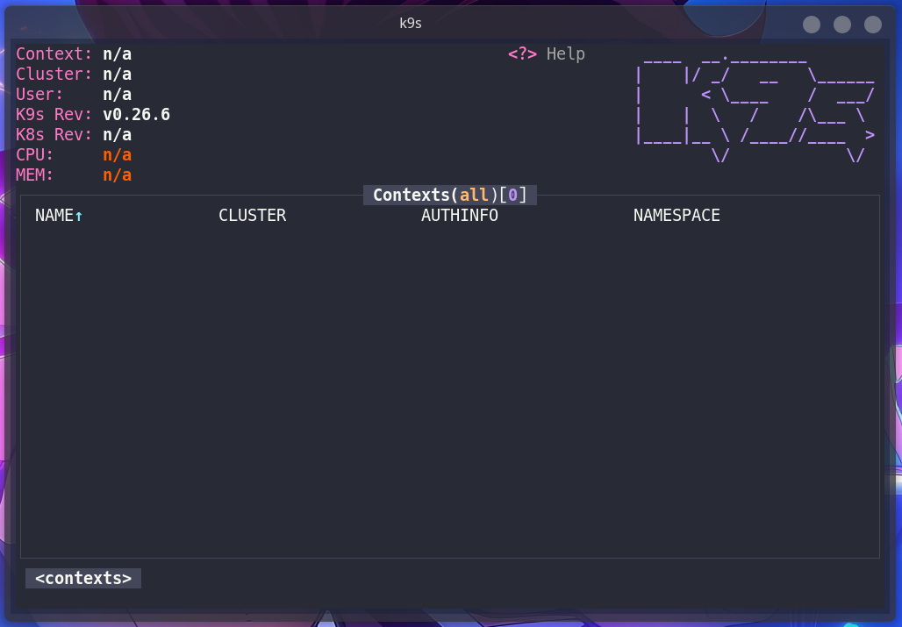

# My configs

## Contains configs for

- [alacritty](https://alacritty.org/)
- [kitty](https://sw.kovidgoyal.net/kitty/)
- [oh-my-zsh](https://ohmyz.sh/)
- [fish shell](https://fishshell.com/)
- [lf](https://github.com/gokcehan/lf)
- [k9s](https://k9scli.io/)
- [tmux](https://github.com/tmux/tmux)

## Appearance

### Alacritty

### Kitty

### lf

### VS Code

### k9s

