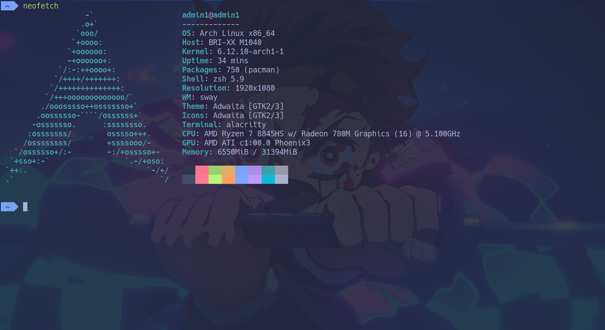

# My configs

## Contains configs for

- [alacritty](https://alacritty.org/)
- [dwm](https://dwm.suckless.org/)
- [dwmblocks](https://github.com/torrinfail/dwmblocks)
- [fish shell](https://fishshell.com/)
- [k9s](https://k9scli.io/)
- [kitty](https://sw.kovidgoyal.net/kitty/)
- [lf](https://github.com/gokcehan/lf)
- [nvim](https://neovim.io/)
- [oh-my-zsh](https://ohmyz.sh/)
- [slock](https://tools.suckless.org/slock/)
- [sublime-text](https://www.sublimetext.com/)
- [sway](https://github.com/swaywm/sway)
- [tmux](https://github.com/tmux/tmux)
- [waybar](https://github.com/Alexays/Waybar)
- [wofi](https://hg.sr.ht/~scoopta/wofi)

## Appearance

### Alacritty

### k9s

### Kitty

### lf

### Neovim

### tmux

### sway and waybar

### wofi

